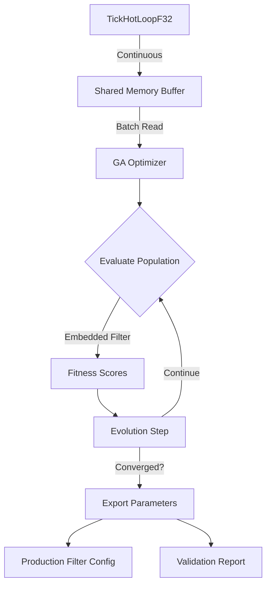

# Genetic Algorithm Optimization System for ComplexBiquad PLL Filter Bank

## System Specification Document
**Version**: 1.0  
**Date**: 2025  
**Purpose**: Optimize ComplexBiquad PLL-enhanced filter bank for tick-based financial data processing

## 11. Performance Considerations

### 11.1 Why Embed the Filter in GA

#### Advantages of Embedded Implementation:
1. **Speed**: ~1000x faster than external calls for GA evaluation
   - No IPC overhead
   - No serialization/deserialization
   - Direct memory access
   - GPU kernel efficiency

2. **GA Efficiency**:
   - Evaluate 100-1000 parameter sets per generation
   - Each evaluation needs 10,000+ samples
   - External calls would add ~1ms overhead per evaluation
   - Total overhead: 100-1000ms per generation (unacceptable)

3. **Telemetry Access**:
   - Direct access to internal filter states
   - No need for telemetry export/import
   - Real-time fitness computation

#### Embedded Filter Verification:
```julia
# Ensure embedded matches production exactly
function verify_filter_equivalence(
    embedded::ComplexBiquadFilter,
    production_executable::String,
    test_samples::Int = 10_000
)
    test_data = randn(ComplexF32, test_samples)
    
    # Run embedded
    embedded_output = process_filter(embedded, test_data)
    
    # Run production (via temp file or pipe)
    prod_output = run_production_filter(production_executable, test_data)
    
    # Compare
    max_diff = maximum(abs.(embedded_output - prod_output))
    @assert max_diff < 1e-7 "Filter outputs differ by $max_diff"
    
    return true
end
```

### 11.2 Data Source Integration Strategy

#### Recommended: Shared Memory for TickHotLoopF32
```julia
# TickHotLoopF32 writes to circular buffer in shared memory
struct SharedMemoryIQBuffer
    shm_id::Int
    ptr::Ptr{ComplexF32}
    size::Int
    write_pos::Ptr{Int64}  # Atomic write position
    read_pos::Ptr{Int64}   # Atomic read position
end

# GA reads batches without blocking TickHotLoopF32
function read_iq_batch!(buffer::SharedMemoryIQBuffer, out::Vector{ComplexF32})
    # Lock-free reading using atomic operations
    write = unsafe_load(buffer.write_pos)
    read = unsafe_load(buffer.read_pos)
    available = mod(write - read, buffer.size)
    
    if available >= length(out)
        # Copy data
        unsafe_copyto!(pointer(out), buffer.ptr + read, length(out))
        # Update read position
        unsafe_store!(buffer.read_pos, mod(read + length(out), buffer.size))
        return true
    end
    return false  # Not enough data available
end
```

### 11.3 Optimization Workflow



## 13. Practical Scaling Guidelines

### 13.1 Recommended Configurations by Use Case

| Use Case | N Filters | Population | Platform | Memory | Time/Gen |
|## 14. PLL Signal Processing Architecture

### 14.1 Dual-Path Signal Flow

```julia
struct DualPathPLL
    # Signal splitting configuration
    use_dual_path::Bool              # Enable split signal path
    phase_detector_path_gain::Float32 # Gain for PD path (typically 1.0)
    filter_path_gain::Float32        # Gain for filter path (typically 1.0)
    
    # Input clamping for phase detector path
    pd_input_clamping::Symbol        # :none, :sign, :soft_limit
    pd_clamp_threshold::Float32      # Threshold for soft_limit
    
    # Error clamping after phase detection
    error_clamping_enabled::Bool     # Enable phase error limiting
    error_clamp_value::Float32       # Maximum phase error (radians)
end

function process_dual_path_pll!(
    pll::DualPathPLL,
    input::ComplexF32,
    filter_state::ComplexBiquadState
)
    if pll.use_dual_path
        # Split signal into two paths
        pd_input = input * pll.phase_detector_path_gain
        filter_input = input * pll.filter_path_gain
        
        # Path 1: Phase detector with optional clamping
        pd_clamped = apply_input_clamping(
            pd_input,
            pll.pd_input_clamping,
            pll.pd_clamp_threshold
        )
        
        # Compute phase error
        phase_error = phase_detect(pd_clamped, pll.vco_output)
        
        # Apply error clamping if enabled
        if pll.error_clamping_enabled
            phase_error = clamp(phase_error, 
                               -pll.error_clamp_value, 
                                pll.error_clamp_value)
        end
        
        # Path 2: Direct to filter bank (unclamped)
        filter_output = process_biquad!(filter_state, filter_input)
        
    else
        # Single path (traditional)
        phase_error = phase_detect(input, pll.vco_output)
        filter_output = process_biquad!(filter_state, input)
    end
    
    return phase_error, filter_output
end
```

### 14.2 Clamping Impact on Lock Quality

```julia
# Analysis of clamping effects
struct ClampingAnalysis
    mode::Symbol
    snr_improvement::Float32      # Noise reduction from amplitude removal
    lock_speed_factor::Float32    # Speed change (>1 = faster)
    cycle_slip_rate::Float32      # Frequency of phase jumps
    capture_range::Float32        # Frequency pull-in range
end

function analyze_clamping_impact(
    iq_data::Vector{ComplexF32},
    clamping_mode::Symbol
)
    # Test with and without clamping
    results_none = run_pll(iq_data, :none)
    results_clamped = run_pll(iq_data, clamping_mode)
    
    # Compare metrics
    snr_improvement = results_clamped.output_snr / results_none.output_snr
    lock_speed_factor = results_none.lock_time / results_clamped.lock_time
    
    # Sign clamping typically:
    # - Improves SNR by 3-6 dB (removes AM noise)
    # - Speeds lock by 20-40% (normalized amplitude)
    # - Increases cycle slips near threshold
    # - Reduces capture range slightly
    
    return ClampingAnalysis(
        clamping_mode,
        snr_improvement,
        lock_speed_factor,
        results_clamped.cycle_slips / results_none.cycle_slips,
        results_clamped.capture_range / results_none.capture_range
    )
end
```

### 14.3 Optimal Clamping Configuration by Period

```julia
function suggest_clamping_config(period::Float32)
    if period < 6.0  # Fast filters
        # High SNR expected, aggressive clamping helps
        return (
            input_clamp_mode = :sign,
            error_clamp_enabled = true,
            error_clamp_value = 0.5  # Tight error limiting
        )
    elseif period < 50.0  # Medium filters
        # Moderate SNR, balanced approach
        return (
            input_clamp_mode = :soft_limit,
            input_clamp_threshold = 2.0,
            error_clamp_enabled = true,
            error_clamp_value = 1.0
        )
    else  # Slow filters
        # Low SNR, preserve signal information
        return (
            input_clamp_mode = :none,
            error_clamp_enabled = true,
            error_clamp_value = π/2  # Loose error limiting
        )
    end
end
```

### 14.4 GA Optimization of Clamping Parameters

```julia
# Fitness function considering clamping effects
function evaluate_clamping_fitness(
    telemetry::PLLTelemetry,
    clamping_config::ClampingConfig
)
    # Reward configurations that:
    # 1. Reduce noise (higher SNR)
    # 2. Achieve faster lock
    # 3. Minimize cycle slips
    # 4. Maintain adequate capture range
    
    score = 0.0
    
    # Input clamping benefits
    if clamping_config.input_mode == :sign
        # Sign clamping removes AM noise
        score += telemetry.snr_improvement * 0.3
        score += (1.0 / telemetry.lock_time) * 0.2
        
        # But penalize if causing cycle slips
        score -= telemetry.cycle_slip_rate * 0.1
    end
    
    # Error clamping benefits
    if clamping_config.error_clamping_enabled
        # Prevents large corrections during noise spikes
        score += telemetry.phase_stability * 0.2
        
        # But check if limiting too much
        if clamping_config.error_threshold < 0.1
            score -= 0.1  # Too restrictive
        end
    end
    
    return score
end
```

## 15. Prediction Weight Optimization Layer

### 15.1 Three-Stage Optimization Architecture

```julia
struct CompleteOptimizationPipeline
    # Stage 1: Filter parameters (completed)
    filter_params::Matrix{Float32}  # [20 genes × n_filters]
    
    # Stage 2: PLL parameters (completed)
    pll_params::Matrix{Float32}     # [included in filter_params]
    
    # Stage 3: Prediction weights (NEW)
    prediction_weights::Array{Float32, 3}  # [n_filters × n_predictions × n_horizons]
    
    # Optimization mode
    optimization_stage::Symbol  # :filters, :weights, :joint, :sequential
end

# Prediction weight structure
struct PredictionWeightBank
    n_filters::Int           # Number of input filters
    n_horizons::Int          # How many ticks ahead to predict (e.g., 1-10)
    n_predictions::Int       # Different prediction targets (price, volume, volatility)
    
    # Weight tensors
    weights::Array{Float32, 3}      # [filters × predictions × horizons]
    biases::Matrix{Float32}         # [predictions × horizons]
    
    # Normalization options
    weight_constraint::Symbol        # :none, :sum_to_one, :bounded
    allow_negative::Bool            # Allow short positions
    sparsity_penalty::Float32       # L1 regularization strength
end
```

### 15.2 Extended Chromosome for Weight Optimization

```julia
struct PredictionChromosome
    # Original filter/PLL parameters (20 × n_filters)
    filter_genes::Matrix{Float32}
    
    # NEW: Prediction weights (n_filters × n_horizons)
    # For predicting 1-10 ticks ahead with 10 filters = 100 additional genes
    prediction_weights::Matrix{Float32}
    
    # NEW: Horizon-specific parameters (n_horizons)
    horizon_scaling::Vector{Float32}    # Time decay factors
    horizon_confidence::Vector{Float32}  # Reliability per horizon
    
    # Total genes: 20×n_filters + n_filters×n_horizons + 2×n_horizons
    # Example: 10 filters, 10 horizons = 200 + 100 + 20 = 320 genes
end

# Encoding for weight genes
struct WeightEncodingSpec
    filter_index::Int
    horizon::Int              # 1, 2, 3... ticks ahead
    min_weight::Float32      # e.g., -1.0 for short
    max_weight::Float32      # e.g., +2.0 for leverage
    scale::Symbol            # :linear, :tanh, :softmax
    regularization::Symbol   # :none, :l1, :l2, :elastic_net
end
```

### 15.3 Prediction Fitness Functions

```julia
struct PredictionFitness
    # Accuracy metrics per horizon
    mse::Vector{Float32}           # Mean squared error [n_horizons]
    mae::Vector{Float32}           # Mean absolute error [n_horizons]
    directional_accuracy::Vector{Float32}  # Sign accuracy [n_horizons]
    
    # Risk-adjusted metrics
    sharpe_ratio::Float32          # Risk-adjusted returns
    max_drawdown::Float32          # Maximum peak-to-trough
    win_rate::Float32              # Profitable predictions %
    
    # Statistical significance
    r_squared::Vector{Float32}     # Explained variance [n_horizons]
    p_values::Vector{Float32}      # Statistical significance [n_horizons]
    
    # Stability metrics
    weight_stability::Float32      # How much weights change over time
    prediction_consistency::Float32  # Variance of predictions
end

function evaluate_prediction_fitness(
    filter_outputs::Matrix{ComplexF32},  # [n_samples × n_filters]
    weights::Matrix{Float32},            # [n_filters × n_horizons]
    future_prices::Matrix{Float32},      # [n_samples × n_horizons]
    config::PredictionConfig
) :: PredictionFitness
    
    n_samples, n_filters = size(filter_outputs)
    n_horizons = size(weights, 2)
    
    # Convert complex filter outputs to features
    features = extract_features(filter_outputs, config.feature_type)
    # Options: :magnitude, :phase, :real, :imag, :both, :power
    
    predictions = zeros(Float32, n_samples - n_horizons, n_horizons)
    
    for h in 1:n_horizons
        for t in 1:(n_samples - h)
            # Weighted sum of filter outputs
            prediction = 0.0f0
            for f in 1:n_filters
                prediction += weights[f, h] * features[t, f]
            end
            predictions[t, h] = prediction
        end
    end
    
    # Calculate fitness metrics
    fitness = PredictionFitness()
    
    for h in 1:n_horizons
        actual = future_prices[h+1:end, h]
        pred = predictions[1:end, h]
        
        fitness.mse[h] = mean((actual - pred).^2)
        fitness.mae[h] = mean(abs.(actual - pred))
        fitness.directional_accuracy[h] = mean(sign.(actual) .== sign.(pred))
        fitness.r_squared[h] = cor(actual, pred)^2
    end
    
    # Risk metrics (using 1-tick predictions for trading)
    returns = calculate_returns(predictions[:, 1], future_prices[:, 1])
    fitness.sharpe_ratio = mean(returns) / std(returns) * sqrt(252)  # Annualized
    fitness.max_drawdown = maximum_drawdown(returns)
    fitness.win_rate = mean(returns .> 0)
    
    # Penalize unstable weights
    if config.penalize_instability
        fitness.weight_stability = 1.0 / (1.0 + std(weights))
    end
    
    return fitness
end
```

### 15.4 Multi-Horizon Weight Optimization

```julia
struct MultiHorizonOptimizer
    # Separate weights for each prediction horizon
    horizons::Vector{Int}  # [1, 2, 3, 5, 10] ticks ahead
    
    # Weight matrix for each horizon
    weights::Dict{Int, Matrix{Float32}}  # horizon => [n_filters × n_features]
    
    # Importance of each horizon in fitness
    horizon_importance::Vector{Float32}  # How much each horizon matters
    
    # Correlation constraints
    max_correlation::Float32  # Maximum correlation between horizons
    diversity_bonus::Float32   # Reward for uncorrelated predictions
end

function optimize_multi_horizon_weights(
    filter_outputs::Matrix{ComplexF32},
    price_data::Vector{Float32},
    horizons::Vector{Int};
    population_size::Int = 100,
    generations::Int = 200
)
    n_filters = size(filter_outputs, 2)
    n_horizons = length(horizons)
    
    # Create expanded chromosome
    # Each individual has weights for all horizons
    chromosome_size = n_filters * n_horizons
    
    # Initialize population with smart seeding
    population = initialize_weight_population(
        chromosome_size,
        population_size,
        method = :correlation_based  # Seed based on filter-price correlations
    )
    
    for gen in 1:generations
        # Evaluate each individual
        fitness_scores = zeros(population_size)
        
        for (idx, individual) in enumerate(population)
            # Reshape to weight matrix
            weights = reshape(individual, n_filters, n_horizons)
            
            # Evaluate prediction accuracy
            pred_fitness = evaluate_prediction_fitness(
                filter_outputs, weights, price_data, horizons
            )
            
            # Combine metrics (weighted by importance and horizon)
            fitness_scores[idx] = compute_combined_fitness(
                pred_fitness, horizons, horizon_importance
            )
        end
        
        # Evolution
        population = evolve_population(
            population, fitness_scores,
            mutation_rate = adaptive_mutation_rate(gen, best_fitness),
            crossover_rate = 0.8
        )
        
        # Optional: Ensemble learning
        if gen % 10 == 0
            elite_weights = get_elite_weights(population, fitness_scores, top_n=5)
            ensemble_fitness = evaluate_ensemble(elite_weights, filter_outputs, price_data)
            println("Gen $gen: Best=$best_fitness, Ensemble=$ensemble_fitness")
        end
    end
    
    return best_weights, optimization_history
end
```

### 15.5 Joint Filter-Weight Optimization

```julia
struct JointOptimizationGA
    # Optimize both filter parameters AND prediction weights
    optimize_filters::Bool
    optimize_weights::Bool
    
    # Coordination strategy
    strategy::Symbol  # :sequential, :alternating, :joint, :hierarchical
    
    # Scheduling
    filter_generations::Int
    weight_generations::Int
    joint_generations::Int
end

function joint_optimization(
    iq_data::Vector{ComplexF32},
    price_data::Vector{Float32},
    config::JointOptimizationGA
)
    if config.strategy == :sequential
        # Step 1: Optimize filters with basic prediction fitness
        filter_params = optimize_filters(iq_data, price_data, 
                                        generations=config.filter_generations)
        
        # Step 2: Fix filters, optimize weights
        filter_outputs = apply_filters(iq_data, filter_params)
        weights = optimize_weights(filter_outputs, price_data,
                                  generations=config.weight_generations)
        
    elseif config.strategy == :alternating
        # Alternate between filter and weight optimization
        filter_params = initialize_filters()
        weights = initialize_weights()
        
        for epoch in 1:config.joint_generations
            if epoch % 2 == 1
                # Odd epochs: optimize filters with current weights
                filter_params = optimize_filters_with_weights(
                    iq_data, price_data, weights, generations=10
                )
            else
                # Even epochs: optimize weights with current filters
                filter_outputs = apply_filters(iq_data, filter_params)
                weights = optimize_weights(filter_outputs, price_data, 
                                         generations=10)
            end
        end
        
    elseif config.strategy == :joint
        # Single massive chromosome with both filters and weights
        # Warning: High dimensional, may need specialized GA operators
        combined_chromosome = [filter_params; flatten(weights)]
        
        # Use CMA-ES or other advanced optimizer for high dimensions
        result = optimize_joint_chromosome(
            combined_chromosome, iq_data, price_data,
            method = :cma_es
        )
        
    elseif config.strategy == :hierarchical
        # Nested optimization: outer loop for filters, inner for weights
        best_filters = nothing
        best_fitness = -Inf
        
        for filter_candidate in filter_population
            # For each filter configuration, find optimal weights
            filter_outputs = apply_filters(iq_data, filter_candidate)
            optimal_weights = optimize_weights(filter_outputs, price_data,
                                              generations=20)
            
            # Evaluate combined system
            fitness = evaluate_complete_system(filter_candidate, optimal_weights,
                                              iq_data, price_data)
            
            if fitness > best_fitness
                best_fitness = fitness
                best_filters = filter_candidate
                best_weights = optimal_weights
            end
        end
    end
    
    return filter_params, weights
end
```

### 15.6 Adaptive Weight Features

```julia
struct AdaptiveWeights
    # Time-varying weights based on market regime
    base_weights::Matrix{Float32}        # [n_filters × n_horizons]
    volatility_adjustment::Matrix{Float32}  # Adjust based on volatility
    trend_adjustment::Matrix{Float32}    # Adjust based on trend strength
    
    # Regime detection
    regime_detector::Function            # Returns :trending, :ranging, :volatile
    regime_weights::Dict{Symbol, Matrix{Float32}}
    
    # Online adaptation
    learning_rate::Float32              # For online weight updates
    adaptation_window::Int              # Samples for adaptation
end

function apply_adaptive_weights(
    filter_outputs::Vector{ComplexF32},
    adaptive_weights::AdaptiveWeights,
    market_state::MarketState
)
    # Detect current regime
    regime = adaptive_weights.regime_detector(market_state)
    
    # Get regime-specific weights
    weights = adaptive_weights.regime_weights[regime]
    
    # Apply volatility scaling
    vol_scale = market_state.volatility / market_state.avg_volatility
    weights *= (1.0 + adaptive_weights.volatility_adjustment * (vol_scale - 1.0))
    
    # Apply trend adjustment
    if abs(market_state.trend_strength) > 0.7
        weights *= (1.0 + adaptive_weights.trend_adjustment * market_state.trend_strength)
    end
    
    # Compute prediction
    prediction = sum(filter_outputs .* weights[:, 1])  # 1-tick ahead
    
    return prediction, weights
end
```

### 15.7 Configuration Extension for Weights

```toml
# config/ga_optimization.toml

[prediction_weights]
enabled = true
n_horizons = 10  # Predict 1-10 ticks ahead
prediction_targets = ["price", "volume", "volatility"]
optimization_mode = "sequential"  # or "joint", "alternating"

[weight_optimization]
population_size = 200  # Can be larger since weights are simpler
generations = 300      # More generations for fine-tuning
feature_extraction = "magnitude"  # How to use complex filter outputs
allow_negative_weights = true     # Allow short positions
weight_sum_constraint = 1.0       # Force weights to sum to 1.0

[weight_fitness]
# Importance of each metric
mse_weight = 0.3
directional_accuracy_weight = 0.4
sharpe_ratio_weight = 0.2
stability_weight = 0.1

# Per-horizon importance (decreasing with time)
horizon_importance = [1.0, 0.9, 0.8, 0.7, 0.6, 0.5, 0.4, 0.3, 0.2, 0.1]

[weight_regularization]
method = "elastic_net"  # L1 + L2 regularization
l1_strength = 0.01      # Sparsity
l2_strength = 0.001     # Smoothness
max_weight = 2.0        # Maximum weight per filter
min_weight = -0.5       # Minimum weight (can short)
```-------|-----------|------------|----------|---------|----------|
| Development/Testing | 5-10 | 200 | CPU | 1 GB | 100 ms |
| Standard Trading | 10-20 | 150 | CPU/GPU | 2 GB | 200 ms |
| High-Resolution | 20-50 | 100 | GPU | 4 GB | 500 ms |
| Research/Analysis | 50-100 | 50 | GPU | 8 GB | 1000 ms |
| Maximum (GPU) | 100-256 | 30 | GPU | 16 GB | 2000 ms |

### 13.2 Performance Scaling Formulas

```julia
# Approximate computation time (milliseconds)
time_cpu_ms = n_filters * population_size * n_samples * 0.00001
time_gpu_ms = (n_filters * population_size * n_samples) / (n_gpu_cores * 100)

# Memory requirements (MB)
memory_mb = (n_filters * 0.072 +  # Filter states/coeffs
            n_filters * population_size * 0.056 +  # Chromosomes
            n_samples * 0.008 +  # Input data
            n_filters * n_samples * 0.008)  # Output data

# Maximum practical limits
max_filters_cpu = min(100, available_memory_gb * 100)
max_filters_gpu = min(256, available_memory_gb * 50, gpu_compute_capability * 32)
```

### 13.3 Multi-GPU Scaling (Future Extension)

```julia
struct MultiGPUConfig
    n_gpus::Int
    distribution::Symbol  # :filter_parallel, :population_parallel, :hybrid
    
    # Filter-parallel: Each GPU handles subset of filters
    # Population-parallel: Each GPU evaluates subset of population
    # Hybrid: 2D decomposition across filters and population
end

function distribute_filters_across_gpus(n_filters::Int, n_gpus::Int)
    filters_per_gpu = ceil(Int, n_filters / n_gpus)
    distribution = []
    
    for gpu in 1:n_gpus
        start_idx = (gpu - 1) * filters_per_gpu + 1
        end_idx = min(gpu * filters_per_gpu, n_filters)
        if start_idx <= n_filters
            push!(distribution, (gpu_id=gpu-1, filters=start_idx:end_idx))
        end
    end
    
    return distribution
end

# Example: 100 filters across 4 GPUs
# GPU 0: filters 1-25
# GPU 1: filters 26-50
# GPU 2: filters 51-75
# GPU 3: filters 76-100
```

---

## 12. Implementation Checklist

### Phase 1: Foundation
- [ ] Setup Julia project structure
- [ ] Implement ComplexBiquad filter (Direct Form II)
- [ ] Validate filter against production implementation
- [ ] Create shared memory interface for TickHotLoopF32
- [ ] Implement basic GA without GPU

### Phase 2: Core GA
- [ ] Implement chromosome encoding/decoding
- [ ] Create fitness evaluation pipeline
- [ ] Add PLL enhancement to filter
- [ ] Implement GA operators (selection, crossover, mutation)
- [ ] Add configuration file parsing

### Phase 3: GPU Acceleration
- [ ] Port filter to CUDA kernels
- [ ] Implement population evaluation kernel
- [ ] Add GPU memory management
- [ ] Create CPU/GPU hybrid mode
- [ ] Benchmark GPU performance

### Phase 4: Integration
- [ ] Connect to live TickHotLoopF32 stream
- [ ] Add parameter export for production
- [ ] Create validation suite
- [ ] Implement band optimization mode
- [ ] Add telemetry recording

### Phase 5: Production
- [ ] Performance optimization
- [ ] Comprehensive testing
- [ ] Documentation
- [ ] Deployment scripts
- [ ] Monitoring tools

---

## 1. Executive Summary

This specification defines a Julia-based Genetic Algorithm (GA) optimization system for a ComplexBiquad PLL-enhanced filter bank operating on tick-based financial data streams. The system optimizes Direct Form II IIR filters at doubled Fibonacci periods with optional CUDA GPU acceleration.

### 1.1 Key Features
- ComplexBiquad filter optimization with PLL enhancement
- Individual or grouped filter band optimization
- CUDA GPU acceleration support
- Tick-based ultra-low-latency processing
- Multi-objective fitness optimization
- Real-time telemetry and performance monitoring

---

## 2. System Architecture

### 2.1 Hybrid Architecture Design

#### 2.1.1 Component Separation
```
EXTERNAL (Reused):
┌─────────────────────────────────────┐
│   TickHotLoopF32 Application        │
│   - Integer arithmetic processing    │
│   - Data cleaning & normalization   │
│   - 4-phase rotation to Complex I/Q │
└─────────────────────────────────────┘
                 ↓
         [Shared Memory / IPC]
                 ↓
GA OPTIMIZER (This Application):
┌─────────────────────────────────────┐
│   ComplexF32 Stream Reader          │
│   ↓                                 │
│   Embedded ComplexBiquad Filters    │
│   ↓                                 │
│   Embedded PLL Enhancement          │
│   ↓                                 │
│   Fitness Evaluation                │
│   ↓                                 │
│   Genetic Algorithm Core            │
└─────────────────────────────────────┘
                 ↓
         [Parameter Export]
                 ↓
PRODUCTION (External):
┌─────────────────────────────────────┐
│   Production Filter Application      │
│   - Uses optimized parameters       │
│   - Runs in real-time trading       │
└─────────────────────────────────────┘
```

#### 2.1.2 Data Interfaces
```julia
# Interface for receiving I/Q data from TickHotLoopF32
abstract type IQDataSource end

struct SharedMemorySource <: IQDataSource
    shm_name::String
    buffer_size::Int
    sample_rate::Float32
end

struct FileSource <: IQDataSource
    filepath::String
    format::Symbol  # :hdf5, :arrow, :jld2
end

struct StreamSource <: IQDataSource
    protocol::Symbol  # :zmq, :nanomsg, :tcp
    address::String
    port::Int
end
```

### 2.2 Data Processing Pipeline
```
External TickHotLoopF32:
    Raw Ticks → Cleaning → AGC → 4-Phase → ComplexF32
                                              ↓
                                    [IPC/Shared Memory]
                                              ↓
GA Optimizer:
    ComplexF32 Buffer → Batch Processing → Filter Bank → Fitness
                              ↓
                     Parallel GA Evaluation
                              ↓
                     Optimal Parameters
                              ↓
Production System:
    Parameters → Live Filter → Trading Signals
```

### 2.2 Filter Specifications

#### 2.2.1 ComplexBiquad Structure
```julia
struct ComplexBiquadFilter
    # Coefficients
    b0::ComplexF32  # Feedforward coefficient 0
    b1::ComplexF32  # Feedforward coefficient 1
    b2::ComplexF32  # Feedforward coefficient 2
    a1::ComplexF32  # Feedback coefficient 1
    a2::ComplexF32  # Feedback coefficient 2
    
    # State variables (Direct Form II)
    x1::ComplexF32  # Input delay state 1
    x2::ComplexF32  # Input delay state 2
    y1::ComplexF32  # Output delay state 1
    y2::ComplexF32  # Output delay state 2
    
    # Filter parameters
    center_frequency::Float32  # Normalized frequency (0-1)
    q_factor::Float32          # Quality factor
    period::Float32            # Doubled Fibonacci period
end
```

#### 2.2.2 PLL Enhancement Parameters
```julia
struct PLLParameters
    # Input preprocessing
    input_clamp_mode::Symbol         # :none, :sign, :soft_limit
    input_clamp_threshold::Float32   # For :soft_limit mode
    
    # Phase detector parameters
    phase_detector_gain::Float32     # Kp: Phase detector gain
    phase_detector_type::Symbol      # :multiplier, :atan2, :cordic
    
    # Phase error clamping (post-detection)
    enable_error_clamping::Bool      # Enable phase error limiting
    error_clamp_threshold::Float32   # Maximum phase error (radians)
    
    # Loop filter parameters
    loop_bandwidth::Float32          # Loop filter bandwidth
    lock_threshold::Float32          # Lock detection threshold
    
    # Oscillator parameters
    ring_decay::Float32              # Oscillator decay during silence
    volume_scaling::Float32          # Input signal scaling
    max_frequency_deviation::Float32 # Maximum frequency tracking range
    
    # Telemetry
    phase_error_history_length::Int  # History buffer size
end

# Signal flow with both clamping types
struct PLLSignalFlow
    # 1. Input signal arrives
    input::ComplexF32
    
    # 2. Apply input clamping (optional)
    clamped_input::ComplexF32
    
    # 3. Phase detection
    phase_error::Float32
    
    # 4. Apply error clamping (optional)
    clamped_error::Float32
    
    # 5. Loop filter
    filtered_error::Float32
    
    # 6. VCO update
    output::ComplexF32
end
```

### 2.3 Filter Bank Configuration

#### 2.3.1 Configurable Filter Count
```julia
struct FilterBankConfig
    # Filter count configuration
    n_filters::Int                    # Range: 1-256 (configurable)
    period_generation::Symbol         # :fibonacci, :harmonic, :octave, :custom
    
    # Period specifications
    base_periods::Vector{Float64}    # User-defined or generated
    period_scaling::Float64           # Multiplication factor (e.g., 2.01)
    min_period::Float64              # Lower bound (e.g., 2.0)
    max_period::Float64              # Upper bound (e.g., 1000.0)
    
    # Sampling configuration
    sampling_rate::Float64           # Tick-based (10-1000 Hz typical)
    nyquist_check::Bool             # Enforce Nyquist criterion
end

# Predefined configurations
const FILTER_CONFIGS = Dict(
    :standard_10 => FilterBankConfig(
        10, :fibonacci, 
        [1, 2, 3, 5, 8, 13, 21, 34, 55, 89],
        2.01, 2.0, 200.0, 100.0, true
    ),
    :extended_20 => FilterBankConfig(
        20, :fibonacci,
        [1, 2, 3, 5, 8, 13, 21, 34, 55, 89, 144, 233, 377, 610, 987, 1597, 2584, 4181, 6765, 10946],
        2.01, 2.0, 500.0, 100.0, true
    ),
    :minimal_5 => FilterBankConfig(
        5, :fibonacci,
        [2, 3, 5, 8, 13],
        2.01, 4.0, 30.0, 100.0, true
    ),
    :harmonic_16 => FilterBankConfig(
        16, :harmonic,
        [1, 2, 3, 4, 5, 6, 7, 8, 9, 10, 11, 12, 13, 14, 15, 16],
        1.0, 1.0, 100.0, 100.0, true
    ),
    :octave_8 => FilterBankConfig(
        8, :octave,
        [1, 2, 4, 8, 16, 32, 64, 128],
        1.0, 1.0, 256.0, 100.0, true
    ),
    :custom => FilterBankConfig(
        0, :custom,  # User specifies everything
        Float64[], 1.0, 0.0, 0.0, 100.0, true
    )
)
```

#### 2.3.2 Scaling Limits

##### CPU Limits
```julia
struct CPUScalingLimits
    max_filters::Int                  # Practical: 100
    max_population::Int               # Practical: 500
    max_samples_per_eval::Int         # Practical: 100,000
    
    # Performance expectations (single-threaded)
    ms_per_filter_sample::Float64    # ~0.001 ms
    ms_per_generation::Float64       # ~100-1000 ms for 100 filters
end

const CPU_LIMITS = CPUScalingLimits(
    100,      # filters
    500,      # population
    100_000,  # samples
    0.001,    # ms per filter-sample
    1000.0    # ms per generation
)
```

##### GPU Limits
```julia
struct GPUScalingLimits
    max_filters::Int                  # Practical: 256
    max_population::Int               # Practical: 10,000
    max_samples_per_eval::Int         # Practical: 1,000,000
    
    # Hardware constraints
    max_threads_per_block::Int       # Typical: 1024
    max_blocks::Int                   # Typical: 65535
    max_shared_memory::Int            # Typical: 48KB per block
    
    # Memory requirements (per filter)
    bytes_per_filter_state::Int      # 4 complex states = 32 bytes
    bytes_per_filter_coeffs::Int     # 5 complex coeffs = 40 bytes
    bytes_per_filter_telemetry::Int  # ~1KB for history
end

const GPU_LIMITS = GPUScalingLimits(
    256,          # filters (limited by block/thread architecture)
    10_000,       # population (limited by GPU memory)
    1_000_000,    # samples (limited by GPU memory)
    1024,         # threads
    65535,        # blocks
    49152,        # 48KB shared memory
    32,           # state bytes
    40,           # coeff bytes
    1024          # telemetry bytes
)
```

#### 2.3.3 Memory Requirements
```julia
function calculate_memory_requirements(
    n_filters::Int,
    population_size::Int,
    n_samples::Int,
    use_gpu::Bool = false
)
    # Per-filter memory
    state_memory = n_filters * 32  # 4 ComplexF32 states
    coeff_memory = n_filters * population_size * 40  # 5 ComplexF32 coeffs
    
    # Sample data memory
    input_memory = n_samples * 8  # ComplexF32 input
    output_memory = n_filters * n_samples * 8  # ComplexF32 output per filter
    
    # GA memory
    chromosome_memory = n_filters * population_size * 14 * 4  # 14 Float32 genes
    fitness_memory = n_filters * population_size * 4  # Float32 scores
    
    # Telemetry memory
    telemetry_memory = n_filters * n_samples * 4  # Simplified telemetry
    
    total_bytes = state_memory + coeff_memory + input_memory + 
                  output_memory + chromosome_memory + fitness_memory + 
                  telemetry_memory
    
    if use_gpu
        # GPU requires duplication for host/device
        total_bytes *= 2
        
        # Add kernel overhead
        total_bytes += n_filters * 1024 * 4  # Working memory per filter
    end
    
    return (
        total_mb = total_bytes / 1_048_576,
        breakdown = Dict(
            "state" => state_memory / 1_048_576,
            "coefficients" => coeff_memory / 1_048_576,
            "input_data" => input_memory / 1_048_576,
            "output_data" => output_memory / 1_048_576,
            "chromosomes" => chromosome_memory / 1_048_576,
            "fitness" => fitness_memory / 1_048_576,
            "telemetry" => telemetry_memory / 1_048_576
        )
    )
end
```

#### 2.3.4 Dynamic Filter Generation
```julia
function generate_filter_periods(
    n_filters::Int,
    method::Symbol = :fibonacci
)
    if method == :fibonacci
        # Generate extended Fibonacci sequence
        fib = [1.0, 2.0]
        while length(fib) < n_filters
            push!(fib, fib[end] + fib[end-1])
        end
        return fib[1:n_filters]
        
    elseif method == :harmonic
        # Harmonic series
        return Float64[i for i in 1:n_filters]
        
    elseif method == :octave
        # Octave spacing (powers of 2)
        return Float64[2^(i-1) for i in 1:n_filters]
        
    elseif method == :geometric
        # Geometric progression
        ratio = 2^(1/3)  # Third-octave spacing
        return Float64[ratio^(i-1) for i in 1:n_filters]
        
    elseif method == :mel
        # Mel-scale spacing (psychoacoustic)
        mel_min = 2595 * log10(1 + 20/700)
        mel_max = 2595 * log10(1 + 1000/700)
        mels = range(mel_min, mel_max, length=n_filters)
        return Float64[700 * (10^(m/2595) - 1) for m in mels]
        
    elseif method == :adaptive
        # Adaptive based on market microstructure
        # Concentrate filters in high-activity frequency bands
        return generate_adaptive_periods(n_filters)
        
    else
        error("Unknown period generation method: $method")
    end
end
```

---

## 3. Genetic Algorithm Specifications

### 3.1 Chromosome Encoding

#### 3.1.1 Gene Structure
```julia
struct FilterChromosome
    # ComplexBiquad parameters (5 genes)
    q_factor::Float32           # Range: [0.5, 100.0], log scale
    bandwidth_factor::Float32   # Range: [0.01, 2.0], log scale
    gain_compensation::Float32  # Range: [0.1, 10.0], linear scale
    phase_offset::Float32       # Range: [-π, π], linear scale
    damping_ratio::Float32     # Range: [0.01, 2.0], log scale
    
    # PLL Input Clamping (3 genes)
    input_clamp_mode::Int8      # 0=none, 1=sign, 2=soft_limit
    input_clamp_threshold::Float32  # Range: [0.1, 10.0], for soft_limit
    input_split_ratio::Float32  # Range: [0.0, 1.0], fraction to phase detector
    
    # PLL Phase Detection (3 genes)
    phase_detector_type::Int8   # 0=multiplier, 1=atan2, 2=cordic
    phase_detector_gain::Float32    # Range: [0.01, 1.0], log scale
    
    # PLL Error Clamping (2 genes)
    enable_error_clamping::Bool     # Binary gene
    error_clamp_threshold::Float32  # Range: [0.01, π], radians
    
    # PLL Loop Filter (4 genes)
    loop_bandwidth::Float32         # Range: [0.001, 0.1], log scale
    lock_threshold::Float32         # Range: [0.01, 0.5], linear scale
    ring_decay::Float32            # Range: [0.99, 0.9999], log scale
    
    # PLL Control (3 genes)
    volume_scaling::Float32         # Range: [0.1, 10.0], linear scale
    max_frequency_deviation::Float32 # Range: [0.1, 2.0], linear scale
    phase_error_history_length::Int # Range: [10, 500], discrete
    
    # Total genes: 20 per filter (increased from 14)
end

# Implementation of input clamping modes
function apply_input_clamping(
    signal::ComplexF32,
    mode::Symbol,
    threshold::Float32 = 1.0
)
    if mode == :none
        return signal
        
    elseif mode == :sign
        # Three-state clamping: +1, 0, -1
        real_part = real(signal)
        imag_part = imag(signal)
        
        clamped_real = real_part > 0 ? 1.0f0 : 
                      real_part < 0 ? -1.0f0 : 0.0f0
        clamped_imag = imag_part > 0 ? 1.0f0 :
                      imag_part < 0 ? -1.0f0 : 0.0f0
        
        return ComplexF32(clamped_real, clamped_imag)
        
    elseif mode == :soft_limit
        # Soft limiting with tanh-like function
        magnitude = abs(signal)
        if magnitude > threshold
            # Preserve phase, limit magnitude
            phase = angle(signal)
            limited_mag = threshold * (2.0 - threshold/magnitude)
            return ComplexF32(limited_mag * cos(phase), 
                            limited_mag * sin(phase))
        else
            return signal
        end
    end
end

# Implementation of phase error clamping
function apply_error_clamping(
    phase_error::Float32,
    enable::Bool,
    threshold::Float32
)
    if !enable
        return phase_error
    end
    
    # Limit phase error to ±threshold
    if phase_error > threshold
        return threshold
    elseif phase_error < -threshold
        return -threshold
    else
        return phase_error
    end
end
```

#### 3.1.2 Encoding Schemes
- **Linear Encoding**: Direct mapping for phase_offset, lock_threshold, etc.
- **Logarithmic Encoding**: For parameters spanning multiple orders of magnitude
- **Binary Encoding**: For boolean flags (enable_clamping)
- **Discrete Encoding**: For integer parameters (phase_error_history_length)

### 3.2 Optimization Modes

#### 3.2.1 Individual Filter Optimization
```julia
struct IndividualOptimizationConfig
    filter_index::Int              # Which filter to optimize (1-10)
    population_size::Int           # Typical: 100-200
    generations::Int               # Typical: 50-200
    mutation_rate::Float32         # Typical: 0.01-0.1
    crossover_rate::Float32        # Typical: 0.6-0.9
    elite_count::Int              # Top performers to preserve
    tournament_size::Int          # For selection pressure
end
```

#### 3.2.2 Grouped Band Optimization
```julia
struct BandGroupConfig
    name::Symbol                   # :fast, :medium, :slow
    filter_indices::Vector{Int}    # Indices of filters in group
    shared_parameters::Vector{Symbol}  # Parameters to share across band
    scaling_factors::Vector{Float32}   # Per-filter scaling within band
end

# Predefined bands
const FILTER_BANDS = Dict(
    :fast => BandGroupConfig(:fast, [1,2,3], [:loop_bandwidth, :phase_detector_gain], [1.0, 0.95, 0.90]),
    :medium => BandGroupConfig(:medium, [4,5,6,7], [:q_factor, :damping_ratio], [1.0, 1.0, 1.0, 1.0]),
    :slow => BandGroupConfig(:slow, [8,9,10], [:ring_decay, :lock_threshold], [1.0, 1.02, 1.05])
)
```

### 3.3 Fitness Function Components

#### 3.3.1 Primary Objectives
```julia
struct FitnessObjectives
    # Signal Quality Metrics (40% weight)
    snr_improvement::Float32        # Signal-to-noise ratio gain
    thd_reduction::Float32          # Total harmonic distortion
    phase_coherence::Float32        # Phase stability measure
    
    # PLL Performance Metrics (30% weight)
    lock_acquisition_time::Float32  # Time to achieve lock
    lock_stability::Float32         # Percentage time in lock
    tracking_accuracy::Float32      # Frequency tracking error RMS
    false_lock_rate::Float32       # False lock events per second
    
    # Filter Response Metrics (20% weight)
    passband_flatness::Float32     # Deviation from ideal response
    stopband_rejection::Float32    # Out-of-band attenuation (dB)
    group_delay_variation::Float32 # Phase linearity measure
    
    # Prediction Metrics (10% weight)
    prediction_correlation::Float32 # Correlation with future prices
    prediction_lag::Float32        # Optimal prediction horizon
end
```

#### 3.3.2 Fitness Calculation
```julia
function calculate_fitness(
    telemetry::FilterTelemetry,
    objectives::FitnessObjectives,
    weights::FitnessWeights,
    period::Float32
) :: Float32
    # Period-adaptive weighting
    adjusted_weights = adjust_weights_for_period(weights, period)
    
    # Normalize each metric to [0,1]
    normalized_scores = normalize_objectives(objectives)
    
    # Apply penalties for constraint violations
    penalty_factor = calculate_penalties(telemetry)
    
    # Weighted sum
    fitness = dot(normalized_scores, adjusted_weights) * penalty_factor
    
    return fitness
end
```

### 3.4 Genetic Operators

#### 3.4.1 Selection Methods
- **Tournament Selection**: Default, configurable tournament size
- **Roulette Wheel**: Optional, fitness-proportionate
- **Rank Selection**: Optional, reduces selection pressure
- **Elitism**: Preserve top N performers

#### 3.4.2 Crossover Operations
```julia
struct CrossoverConfig
    method::Symbol  # :uniform, :single_point, :two_point, :arithmetic
    rate::Float32   # Probability of crossover
    alpha::Float32  # Blending factor for arithmetic crossover
end
```

#### 3.4.3 Mutation Operations
```julia
struct MutationConfig
    method::Symbol        # :gaussian, :uniform, :adaptive
    rate::Float32        # Base mutation probability
    sigma::Float32       # Gaussian mutation std dev
    adapt_sigma::Bool    # Adaptive mutation strength
    min_sigma::Float32   # Minimum mutation strength
    max_sigma::Float32   # Maximum mutation strength
end
```

---

## 4. GPU Acceleration Specifications

### 4.1 CUDA Configuration

#### 4.1.1 GPU Memory Layout
```julia
struct GPUFilterBank
    # Device arrays
    d_iq_data::CuArray{ComplexF32, 2}      # [n_samples, n_batches]
    d_filter_states::CuArray{ComplexF32, 3} # [4, n_filters, n_batches]
    d_filter_coeffs::CuArray{ComplexF32, 3} # [5, n_filters, n_populations]
    d_pll_states::CuArray{Float32, 3}       # [n_pll_params, n_filters, n_populations]
    d_output::CuArray{ComplexF32, 3}        # [n_samples, n_filters, n_populations]
    d_fitness::CuArray{Float32, 2}          # [n_filters, n_populations]
    
    # Kernel configuration
    threads_per_block::Int  # Typical: 256
    blocks_per_grid::Int    # Calculated based on problem size
    shared_memory_size::Int # Per-block shared memory
end
```

#### 4.1.2 Kernel Specifications
```julia
# Primary GPU kernels required
@cuda_kernel evaluate_population_kernel!(...)  # Parallel fitness evaluation
@cuda_kernel filter_process_kernel!(...)       # Biquad filter processing
@cuda_kernel pll_update_kernel!(...)          # PLL state updates
@cuda_kernel crossover_kernel!(...)           # Parallel crossover
@cuda_kernel mutation_kernel!(...)            # Parallel mutation
```

### 4.2 CPU/GPU Hybrid Strategy
```julia
struct HybridConfig
    gpu_threshold::Int        # Minimum population for GPU (typical: 50)
    batch_size::Int          # Samples per GPU batch
    prefetch_enabled::Bool   # Overlap transfer/compute
    multi_gpu::Bool          # Use multiple GPUs if available
    gpu_selection::Symbol    # :auto, :manual, :round_robin
end
```

---

## 5. Implementation Requirements

### 5.1 Required Julia Packages
```julia
# Core packages
using Random
using Statistics
using LinearAlgebra
using DSP
using FFTW

# GA and optimization
using Evolutionary  # Optional, for reference implementations
using BlackBoxOptim # Optional, for hybrid approaches

# GPU support
using CUDA
using KernelAbstractions
using GPUArrays

# Data handling
using JLD2
using HDF5
using Arrow
using DataFrames
using CSV

# Inter-process communication
using SharedArrays
using Mmap
using ZMQ  # For stream sources
using Sockets

# Parallel processing
using Distributed
using Threads

# Utilities
using ProgressMeter
using Logging
using BenchmarkTools
```

### 5.2 Module Structure
```
ComplexBiquadGA/
├── src/
│   ├── ComplexBiquadGA.jl        # Main module
│   ├── Types.jl                  # Type definitions
│   ├── DataInterface/
│   │   ├── IQReader.jl           # Interface to TickHotLoopF32
│   │   ├── SharedMemory.jl       # Shared memory reader
│   │   ├── FileReader.jl         # HDF5/Arrow/JLD2 readers
│   │   └── StreamReader.jl       # ZMQ/TCP stream reader
│   ├── Filters/
│   │   ├── ComplexBiquad.jl      # Embedded filter implementation
│   │   ├── FilterBank.jl         # Multi-filter processing
│   │   └── Coefficients.jl       # Coefficient design functions
│   ├── PLL/
│   │   ├── PLLCore.jl            # Embedded PLL implementation
│   │   ├── PhaseDetector.jl      # Phase detection algorithms
│   │   └── LoopFilter.jl         # Loop filter variants
│   ├── GA/
│   │   ├── Encoding.jl           # Chromosome encoding/decoding
│   │   ├── Population.jl         # Population management
│   │   ├── Operators.jl          # Selection, crossover, mutation
│   │   ├── Fitness.jl            # Fitness evaluation
│   │   └── Evolution.jl          # Main GA loop
│   ├── GPU/
│   │   ├── Kernels.jl           # CUDA kernels
│   │   ├── FilterKernels.jl     # GPU biquad implementation
│   │   ├── Memory.jl            # GPU memory management
│   │   └── Hybrid.jl            # CPU/GPU coordination
│   ├── Export/
│   │   ├── Parameters.jl         # Parameter export formats
│   │   ├── Telemetry.jl         # Telemetry recording
│   │   └── Reports.jl           # Optimization reports
│   └── Utils/
│       ├── Benchmarking.jl      # Performance measurement
│       ├── Visualization.jl      # Result plotting
│       └── Config.jl            # Configuration management
├── test/
│   ├── runtests.jl
│   ├── test_filters.jl          # Verify filter implementation
│   ├── test_data_interface.jl   # Test data sources
│   ├── test_ga.jl               # GA algorithm tests
│   └── test_gpu.jl              # GPU kernel tests
├── scripts/
│   ├── setup_shared_memory.jl   # Initialize shared memory
│   ├── benchmark_configs.jl     # Test different configurations
│   └── validate_against_production.jl  # Compare with existing filter
└── examples/
    ├── file_based_optimization.jl    # Optimize from HDF5/Arrow files
    ├── stream_optimization.jl        # Real-time stream optimization
    ├── parameter_export.jl          # Export to production format
    └── gpu_benchmark.jl             # GPU performance testing
```

### 5.3 Configuration File Format
```toml
# config/ga_optimization.toml

[general]
mode = "individual"  # or "grouped", "full_bank"
use_gpu = true
random_seed = 12345
output_dir = "./results"
validate_against_production = true

[filter_bank]
n_filters = 10  # Configurable: 1-256 (CPU), 1-100 recommended
period_generation = "fibonacci"  # or "harmonic", "octave", "custom", "adaptive"
period_scaling = 2.01
min_period = 2.0
max_period = 200.0

# For custom periods (if period_generation = "custom")
# custom_periods = [2.5, 5.0, 7.5, 10.0, 15.0, 20.0, 30.0, 50.0, 75.0, 100.0]

[scaling]
# Automatic scaling based on filter count
auto_adjust_population = true  # Reduce population for many filters
auto_adjust_samples = true     # Reduce samples for many filters

# Manual overrides
max_memory_gb = 8.0  # Maximum memory usage
target_generation_time_ms = 1000.0  # Target time per generation

[data_source]
type = "shared_memory"  # or "file", "stream"
shm_name = "/tickhotloop_iq_buffer"
buffer_size = 1048576
sample_rate = 100.0

[data]
validation_split = 0.2
warmup_samples = 1000
batch_size = 10000  # Samples per fitness evaluation

[filter_implementation]
embedded = true
external_filter_path = ""
verification_samples = 100

[ga_parameters]
population_size = 150  # Will be adjusted based on n_filters
generations = 100
elite_count = 5
tournament_size = 5

# Dynamic population sizing
# if n_filters > 20: population_size = 150 * (10/n_filters)
# if n_filters > 50: population_size = max(50, 1000/n_filters)

[gpu_config]
device_id = 0
threads_per_block = 256  # Must divide evenly into n_filters for optimal performance
batch_size = 10000
use_mixed_precision = false
max_filters_per_kernel = 256  # GPU kernel limit

[ga_parameters]
population_size = 150
generations = 100
elite_count = 5
tournament_size = 5

[ga_operators]
crossover_method = "arithmetic"
crossover_rate = 0.8
mutation_method = "adaptive"
mutation_rate = 0.05
mutation_sigma = 0.1

[fitness_weights]
snr_improvement = 0.15
lock_stability = 0.20
tracking_accuracy = 0.15
passband_flatness = 0.10
stopband_rejection = 0.10
prediction_correlation = 0.20
computational_efficiency = 0.10

[gpu_config]
device_id = 0
threads_per_block = 256
batch_size = 10000
use_mixed_precision = false
```

---

## 6. Performance Requirements

### 6.1 Computational Performance
- **CPU Processing**: < 100ms per generation for 100 population size
- **GPU Processing**: < 10ms per generation for 100 population size
- **Memory Usage**: < 4GB for typical optimization run
- **Convergence**: 80% fitness improvement within 50 generations

### 6.2 Filter Performance Targets
- **Lock Acquisition**: < 10 periods for fast filters, < 50 for slow
- **SNR Improvement**: > 10dB minimum, > 20dB target
- **Phase Tracking Error**: < 0.1 radians RMS
- **Prediction Correlation**: > 0.3 for 1-step ahead

### 6.3 Scalability Requirements
- Support for 10-100 filters simultaneously
- Population sizes from 50 to 1000
- Tick data streams up to 1M samples
- Multi-GPU scaling efficiency > 80%

---

## 7. Output Specifications

### 7.1 Result Files
```julia
struct OptimizationResults
    # Best solutions
    best_chromosomes::Matrix{Float32}      # [n_genes, n_filters]
    best_fitness_scores::Vector{Float32}   # [n_filters]
    
    # Evolution history
    fitness_history::Matrix{Float32}       # [n_generations, n_filters]
    diversity_history::Vector{Float32}     # [n_generations]
    
    # Performance metrics
    final_telemetry::Dict{Int, FilterTelemetry}
    convergence_generation::Vector{Int}
    
    # Configuration used
    config::OptimizationConfig
    timestamp::DateTime
end
```

### 7.2 Telemetry Output
```julia
struct FilterTelemetry
    # Time series data
    phase_error::Vector{Float32}
    frequency_estimate::Vector{Float32}
    lock_indicator::Vector{Bool}
    output_magnitude::Vector{Float32}
    output_phase::Vector{Float32}
    
    # Statistical summaries
    mean_lock_time::Float32
    lock_percentage::Float32
    phase_jitter_rms::Float32
    frequency_stability::Float32
    
    # Spectral analysis
    frequency_response::Vector{ComplexF32}
    impulse_response::Vector{ComplexF32}
    group_delay::Vector{Float32}
end
```

### 7.3 Export Formats
- **JLD2**: Complete results with full precision
- **CSV**: Summary statistics and best parameters
- **JSON**: Configuration and metadata
- **HDF5**: Optional, for interoperability
- **Plots**: PNG/SVG fitness evolution, frequency responses

---

## 8. Testing Requirements

### 8.1 Unit Tests
- Chromosome encoding/decoding validation
- ComplexBiquad filter coefficient calculation
- PLL state update correctness
- Fitness function component tests
- GA operator functionality

### 8.2 Integration Tests
- End-to-end optimization on synthetic data
- GPU/CPU result consistency
- Configuration file parsing
- Multi-threaded execution safety

### 8.3 Performance Tests
- Benchmark suite for all major operations
- GPU kernel performance profiling
- Memory leak detection
- Convergence rate analysis

### 8.4 Validation Tests
- Known optimal solution recovery
- Stability under edge cases
- Numerical precision verification
- Cross-platform compatibility

---

## 9. Usage Examples

### 9.1 Configurable Filter Count Examples
```julia
using ComplexBiquadGA

# Example 1: Standard 10 filters (Fibonacci)
config_10 = FilterBankConfig(
    n_filters = 10,
    period_generation = :fibonacci,
    base_periods = generate_filter_periods(10, :fibonacci),
    period_scaling = 2.01
)

# Example 2: Extended 20 filters for higher resolution
config_20 = FilterBankConfig(
    n_filters = 20,
    period_generation = :fibonacci,
    base_periods = generate_filter_periods(20, :fibonacci),
    period_scaling = 2.01
)

# Example 3: Maximum GPU configuration (256 filters)
config_max_gpu = FilterBankConfig(
    n_filters = 256,
    period_generation = :geometric,  # Better distribution for many filters
    base_periods = generate_filter_periods(256, :geometric),
    period_scaling = 1.0
)

# Check memory requirements
mem_10 = calculate_memory_requirements(10, 150, 10_000, false)
println("10 filters (CPU): $(mem_10.total_mb) MB")

mem_256 = calculate_memory_requirements(256, 50, 10_000, true)
println("256 filters (GPU): $(mem_256.total_mb) MB")
```

### 9.2 Adaptive Filter Count Based on Resources
```julia
function determine_optimal_filter_count(
    available_memory_gb::Float64,
    use_gpu::Bool,
    target_generation_time_ms::Float64
)
    if use_gpu
        # GPU constraints
        max_by_memory = floor(Int, available_memory_gb * 1024 / 50)  # ~50MB per filter
        max_by_compute = 256  # CUDA kernel limit
        optimal = min(max_by_memory, max_by_compute)
    else
        # CPU constraints
        max_by_memory = floor(Int, available_memory_gb * 1024 / 10)  # ~10MB per filter
        max_by_time = floor(Int, target_generation_time_ms / 10)  # ~10ms per filter
        optimal = min(max_by_memory, max_by_time, 100)  # Cap at 100 for CPU
    end
    
    return optimal
end

# Determine best configuration for system
optimal_n = determine_optimal_filter_count(8.0, true, 1000.0)
println("Optimal filter count: $optimal_n")
```

### 9.3 Custom Period Configuration
```julia
# Custom periods based on market analysis
custom_periods = [
    2.5,   # Ultra-fast scalping
    5.0,   # Fast scalping
    10.0,  # Short-term momentum
    20.0,  # Intraday trends
    50.0,  # Daily patterns
    100.0, # Weekly cycles
    200.0, # Monthly seasonality
    500.0  # Quarterly trends
]

config_custom = FilterBankConfig(
    n_filters = length(custom_periods),
    period_generation = :custom,
    base_periods = custom_periods,
    period_scaling = 1.0
)

# Optimize with custom configuration
ga_custom = create_optimizer(config_custom)
results = optimize_all_filters(ga_custom, use_gpu=true)
```

### 9.4 Scaling Strategy for Different Filter Counts
```julia
function create_scaled_ga_config(n_filters::Int)
    # Adjust GA parameters based on filter count
    if n_filters <= 10
        # Small bank - can afford large population
        population_size = 200
        batch_size = 20_000
        generations = 150
    elseif n_filters <= 50
        # Medium bank - moderate population
        population_size = 100
        batch_size = 10_000
        generations = 100
    elseif n_filters <= 100
        # Large bank - reduced population
        population_size = 50
        batch_size = 5_000
        generations = 75
    else
        # Very large bank - minimal population
        population_size = 30
        batch_size = 2_000
        generations = 50
    end
    
    return GAConfig(
        population_size = population_size,
        batch_size = batch_size,
        generations = generations,
        parallel_filters = n_filters <= 50  # Parallelize if reasonable
    )
end
```

### 9.5 GPU Kernel Configuration for Variable Filter Counts
```julia
function configure_gpu_kernels(n_filters::Int)
    # Optimize thread/block configuration
    if n_filters <= 32
        # One filter per warp
        threads_per_block = 32
        filters_per_block = 1
    elseif n_filters <= 256
        # Multiple warps per block
        threads_per_block = 256
        filters_per_block = 256 ÷ n_filters
    else
        error("Too many filters for single GPU: $n_filters > 256")
    end
    
    blocks = ceil(Int, n_filters / filters_per_block)
    
    return (
        threads = threads_per_block,
        blocks = blocks,
        shared_memory = 48_000 ÷ filters_per_block  # Divide shared memory
    )
end

# Example: Configure for 64 filters
kernel_config = configure_gpu_kernels(64)
println("GPU Config: $(kernel_config.blocks) blocks × $(kernel_config.threads) threads")
```

---

## 10. Future Extensions

### 10.1 Planned Enhancements
- Adaptive chromosome encoding based on convergence
- Multi-objective Pareto optimization
- Reinforcement learning hybrid approach
- Real-time adaptation during live trading
- Distributed optimization across cluster

### 10.2 Research Directions
- Quantum-inspired genetic algorithms
- Neural architecture search for filter topology
- AutoML for hyperparameter tuning
- Transfer learning across different markets
- Explainable AI for filter parameter selection

---

## Appendix A: Mathematical Foundations

### A.1 ComplexBiquad Transfer Function
```
H(z) = (b0 + b1*z^-1 + b2*z^-2) / (1 + a1*z^-1 + a2*z^-2)
```

### A.2 Direct Form II Implementation
```
w[n] = x[n] - a1*w[n-1] - a2*w[n-2]
y[n] = b0*w[n] + b1*w[n-1] + b2*w[n-2]
```

### A.3 Bilinear Transform
```
s = 2*fs * (1 - z^-1) / (1 + z^-1)
```

### A.4 Q Factor to Bandwidth Relationship
```
BW = fc / Q
```
Where fc is center frequency and BW is -3dB bandwidth

---

## Appendix B: GPU Kernel Pseudocode

### B.1 Population Evaluation Kernel
```cuda
__global__ void evaluate_population_kernel(
    ComplexF32* iq_data,
    FilterParams* population,
    float* fitness_scores,
    int n_samples,
    int pop_size
) {
    int tid = blockIdx.x * blockDim.x + threadIdx.x;
    if (tid < pop_size) {
        // Process one individual
        FilterParams params = population[tid];
        float fitness = evaluate_filter(iq_data, params, n_samples);
        fitness_scores[tid] = fitness;
    }
}
```

---

## Document Version History
- v1.0 (Current): Initial specification
- v1.1 (Planned): Add distributed computing support
- v2.0 (Future): Multi-objective optimization expansion